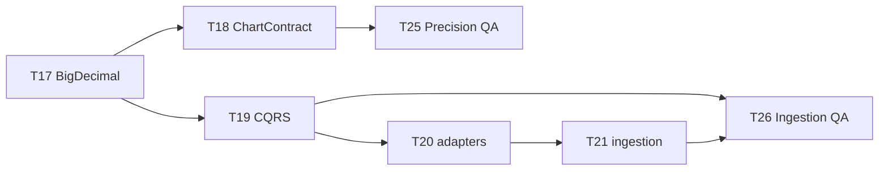

# Wave 3 — Five-Ticket Collaborative Sprint

_Orchestrator: use this plan when spawning subagents. Read `_master-context.md` first._

## Wave goal

Complete **Phase 1 (precision math)** and **start Phase 2 (CQRS)** with independent QA sign-off — the first collaborative multi-agent sprint after T16.

## Five tickets in this wave

| # | Ticket | Phase | Primary owner | Staff Eng | QA gate |
|---|---|---|---|---|---|
| 1 | **ETH-T17** | 1 | Backend (lane A) | Required | `mvn test` + float/double scan |
| 2 | **ETH-T18** | 1 | Backend (lane A) | Required | `mvn test` + ChartContract fixtures |
| 3 | **ETH-T19** | 2 | Backend (lane B) | Required | `mvn test` + Flyway migration |
| 4 | **ETH-T25** | 1 QA | QA | N/A (is QA) | Independent precision suite |
| 5 | **ETH-T26** | 2 QA | QA | N/A (is QA) | Ingestion integration (after T19–T21) |

**Not in this wave (blocked):** T20/T21 (extend wave after T19), T24 (needs T18+T22+T23), Frontend implementation.

## Dependency DAG



## Collaborative schedule (orchestrator)

### Stage 1 — T17 single lane (all roles engaged)

| Agent | Action |
|---|---|
| **PM** | Confirm T17 unblocked; open tracking row |
| **Backend A** | Implement T17 in worktree |
| **Staff Engineer** | Review → `.grok/reviews/ETH-T17-review.md` |
| **QA** | Run T17 acceptance gate in shell (only after APPROVED) |
| **PM** | Closeout T17 |
| **UI/UX** | Read-only: preview T18 ChartContract ticket for terminology |

### Stage 2 — T18 + T19 parallel (two backend lanes)

| Agent | Action |
|---|---|
| **Backend A** | T18 ChartContract v2 (worktree `feat/t18`) |
| **Backend B** | T19 Postgres CQRS (worktree `feat/t19`) |
| **Staff Engineer** | Review each lane independently |
| **QA** | Gate each ticket after its review APPROVED |
| **PM** | Track both lanes; do not close until both green |
| **UI/UX** | Review ChartContract display strings for TradFi lexicon |

### Stage 3 — QA sign-offs

| Agent | Action |
|---|---|
| **QA** | **T25** after T17+T18 both Done — independent precision audit |
| **Backend B** | Continue T20→T21 if in scope extension |
| **QA** | **T26** after T19+T20+T21 Done — ingestion QA |
| **Staff Engineer** | Optional review of QA test additions |

### Stage 4 — Wave retrospective

| Agent | Action |
|---|---|
| **PM** | Update `_TICKETS-INDEX.md`; announce Wave 4 (T20–T22) |
| **Orchestrator** | Post summary: tickets closed, test counts, blockers |

## Spawn checklist (orchestrator)

For **every** ticket in this wave:

- [ ] PM confirmed unblocked
- [ ] Implementer: `readonly: false`, `isolation: worktree`
- [ ] Staff Engineer: `readonly: true`, writes review file
- [ ] QA: `readonly: false`, `capability_mode: all`, runs `mvn -q test`
- [ ] PM closeout only after Staff Engineer APPROVED + QA PASS

## Wave 3 kickoff prompt

```
Act as orchestrator for Wave 3 (see .grok/waves/wave-3-five-ticket.md).

Shared context: .grok/prompts/_master-context.md
Pipeline: PM → Backend → Staff Engineer → QA → PM

Begin Stage 1: ETH-T17 only.
Post status table after each subagent. Ctrl+B for live view.
```